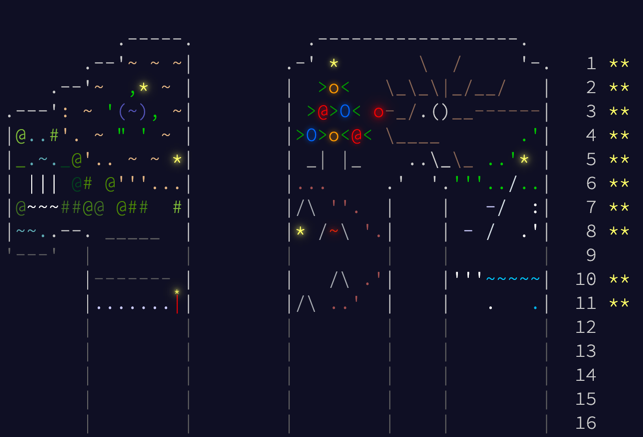
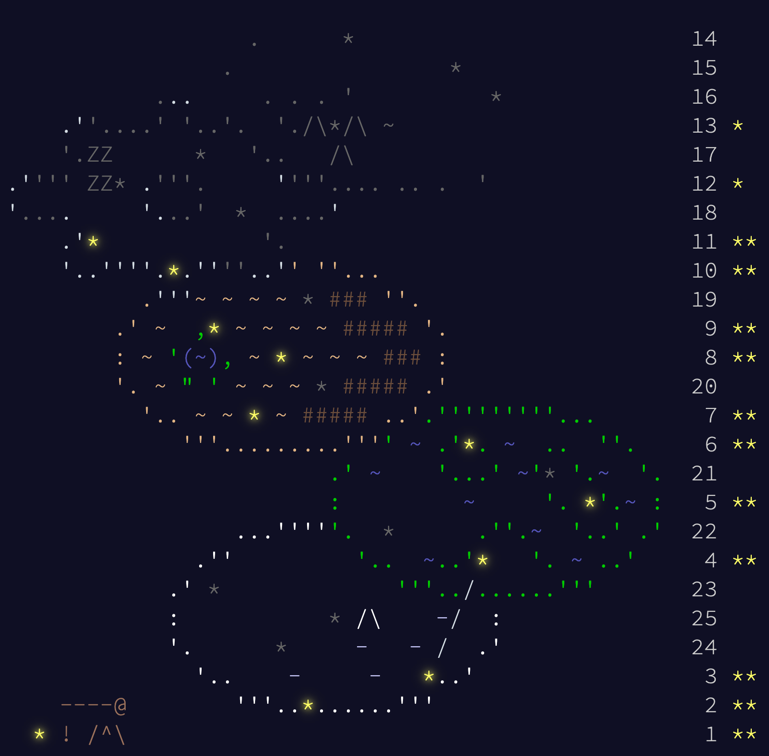

# Advent of Code Solutions

[](https://github.com/illiafox/adventofcode/actions/workflows/test.yaml)

This repository contains my solutions for the [Advent of Code](https://adventofcode.com/) challenges. Each year is
organized into its own folder, with the corresponding problems and solutions.

## Structure

#### 2025

- `year/2025/rust/src`: Rust solutions
    - `day_1/`, `day_2/`, ...:
        - `input.txt`, `example_input.txt` - Test input files
        - `mod.rs` - Solution with tests
- Example: [Day 1](year/2025/rust/src/day_1)

#### 2024

- `year/2024/`: Folder for each year.
    - `day1/`, `day2/`, ...: Solutions for each day.
        - `testdata/` - Test input files
        - `go/`, `ts/`, `rust/` - Implementations
- Example: [Day 1](year/2024/day1)

## Usage

1. Clone the repository:
   ```bash
   git clone https://github.com/illiafox/adventofcode.git
   ```

#### 2025

2. Navigate to the folder:
   ```bash
   cd year/2024/rust
   ```
3. Run tests
    ```bash
    cargo test
    ```

#### 2024

2. Navigate to the folder:
   ```bash
   cd year/2024/day1
   ```
3. (Optional) Add your inputs into `testdata` folder
    ```bash
    cp /path/myinput.txt testdata/
    ```
4. Choose and run any available implementation:
    ```bash
   # For golang 
   go run go/main.go testdata/input.txt # or testdata/myinput.txt
    ```

# Leaderboard

I'm participating in a private leaderboard with code `3470240-72ff333e`.
To join it, visit [Private Leaderboards](https://adventofcode.com/2024/leaderboard/private) page and enter the code
above

# Contributing

Please refer to [CONTRIBUTING.md](CONTRIBUTING.md)

## License

This repository is open-source and available under the [BSL-1.0 license](LICENSE).

### Years

- 2025 - In progress!
- 2024
  
- 2023
  